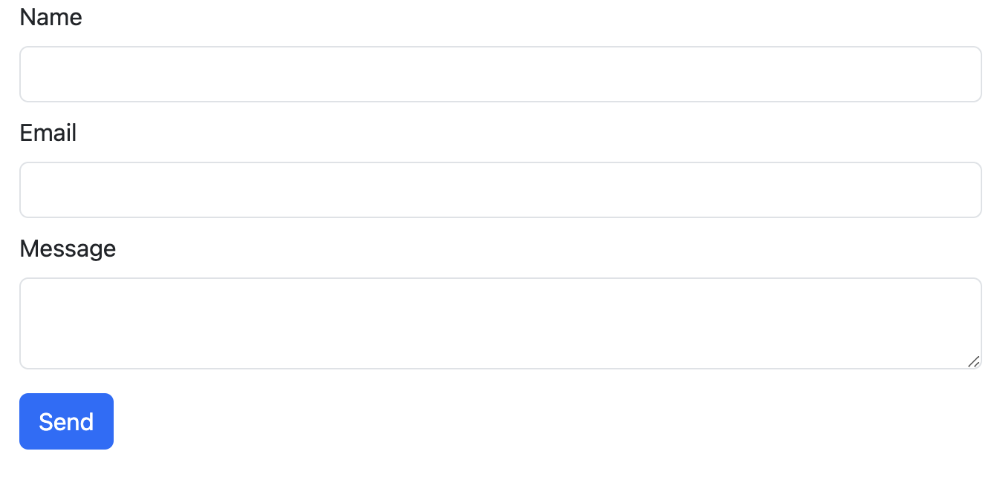

<h1 align="center">
   
  
   
  Telegram form sender
   
  <h4 align="center">Telegram form sender using HTML, Bootstrap, JavaScript, Axios
</h1>

> [Portfolio 👨‍💻](https://yuriy-kulakovskyi.github.io/Portfolio/) 
